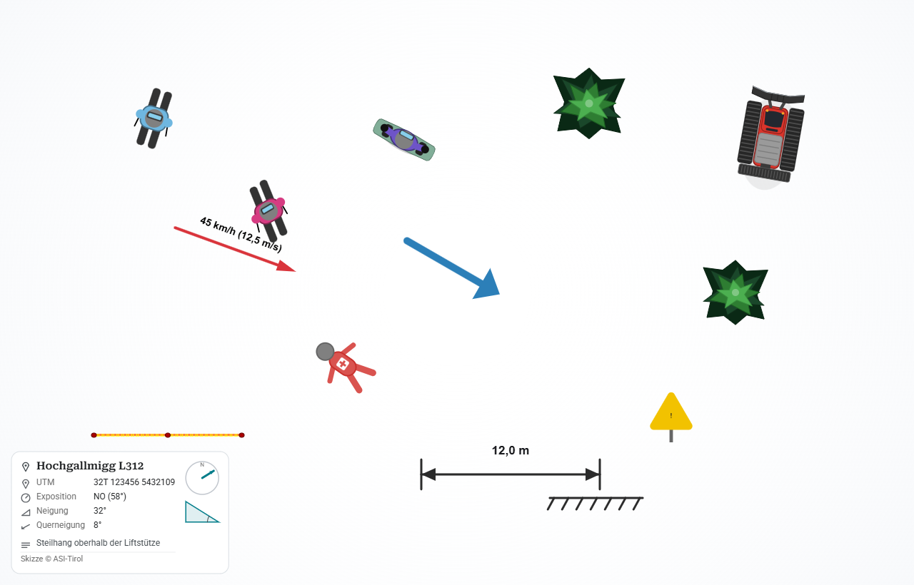

# Ski-Simulation

Web-App zum schnellen Skizzieren von **Alpinunfällen in Vogelperspektive** — für
Sachverständige und Fachleute (Ski-, Rodel-, Pistenunfälle). Objekte werden aus
einem Dock auf eine Zeichenfläche gezogen, beschriftet, bemaßt und als Bild oder
Projekt exportiert.

**Live:** [asolvo.github.io/skisim](https://asolvo.github.io/skisim/)



---

## Funktionen

- **Objekte platzieren** per Ziehen (Maus) oder Antippen (Touch), beliebig oft.
- **Personen-Figuren:** Skifahrer (Schulter gerade/vor/zurück), Pflugfahrer,
  Snowboarder, Rodler, verletzte Person — einfärbbar aus einer Skimode-Palette.
- **Fahrzeuge:** Schneemobil (Ski-Doo-Zweisitzer) und Pistenraupe (PistenBully-Stil),
  einfärbbar.
- **Umgebung/Gelände:** Bäume, Fangzaun, Schild (5 Formen, mehrzeilige Beschriftung),
  Böschung, Liftstütze.
- **Annotation:** Linien, Pfeile, V-Form, Box/Hindernis, Textfelder,
  Geschwindigkeits-Vektor (km/h → m/s), Bemaßung mit konstanter Linienbreite.
- **Mehrfachauswahl:** Aufziehrechteck oder Umschalt+Klick, gemeinsames Verschieben/
  Löschen.
- **Szenario-Metadaten & Legende:** Ort, Koordinaten (UTM/WGS84), Exposition
  (Kompass), Neigung, Querneigung, Beschreibung — als Legende auf der Fläche und im
  PNG-Export, optional mit Copyright-Fußzeile.
- **Rückgängig/Wiederholen, Autosave** und Verlustschutz beim Schließen.
- **Speichern/Laden** als JSON, **PNG-Export** (HiDPI-scharf), **Teilen**, mit
  Ordnerwahl und sprechenden Dateinamen.
- **Barrierefrei** (WCAG 2.1 AA), vollständig per Tastatur bedienbar, **Deutsch/
  Englisch**, helles/dunkles/automatisches Design.
- **KI-Fernsteuerung** optional per MCP-Server (siehe unten).
- **Installierbar (PWA):** über den Browser als App installierbar (eigenes Fenster,
  Icon), funktioniert danach vollständig offline.

## Bedienung (Kurzreferenz)

| Aktion | Maus/Touch | Tastatur |
|---|---|---|
| Verschieben | Ziehen / 1 Finger | Pfeiltasten |
| Drehen | Rechte Maustaste / 2 Finger | `,` / `.` |
| Zoomen/Skalieren | Mausrad / 2 Finger | `+` / `-` |
| Hinzufügen/Duplizieren | Dock ziehen/tippen | `Einfg` |
| Löschen | ins Dock ziehen | `Entf` |
| Bearbeiten (Text/Schild/…) | Doppelklick/-tipp | `Enter` |
| Farbe wechseln | Farbleiste | `c` |
| Rückgängig / Wiederholen | Pfeil-Buttons | `Strg+Z` / `Strg+Y` |
| Objekte durchschalten | — | `Tab` |
| Speichern / Export / Laden | Toolbar-Buttons | `s` / `e` / `o` |

## Lizenzmodell

- **Gast (ohne Lizenz):** ausprobieren, max. **eine** Personen-Figur; Speichern,
  PNG-Export und Teilen sind gesperrt.
- **Voll-Lizenz:** beliebig viele Figuren/Objekte, Speichern/Laden, Export, Teilen,
  KI-Fernsteuerung.

Lizenzen sind **signierte ES256-Tokens** aus einem Cloudflare Worker (30 Tage
offline gültig, automatischer Refresh, zentral widerrufbar). Lizenz anfordern:
[alpinesicherheit.com/skisim](https://alpinesicherheit.com/skisim).

## KI-Fernsteuerung (MCP)

Die Skizze lässt sich optional von einem KI-Assistenten (MCP-Client wie Claude
Desktop/Code) steuern — Objekte hinzufügen/verschieben/färben, Szene als JSON
lesen/laden, Screenshot anfordern. Der lokale Server liegt in
[`mcp-server/`](mcp-server/README.md); Verbindung nur bei aktiver Lizenz und über
einen in der App angezeigten Kopplungscode.

## Technik & Architektur

- **Single-File-App:** die gesamte Anwendung (HTML + CSS + JS + Inline-SVG +
  Inline-Schriften) liegt in `index.html`; gezeichnet wird auf einem `<canvas>` (2D).
- **PWA:** installierbar und vollständig offline (Schriften eingebettet, Service
  Worker cacht die App); die Einzeldatei bleibt auch per `file://` lauffähig. Siehe
  [ADR-0031](docs/adr/0031-pwa-installierbar-offline.md).
- **Auslieferung:** GitHub Pages; Lizenz-Backend als Cloudflare Worker + KV.
- **Design:** Material Design 3 mit tonalem Farb-Token-System (hell/dunkel).
- Die wesentlichen Entscheidungen sind als **ADRs** dokumentiert:
  [`docs/adr/`](docs/adr/README.md).

## Projektstruktur

```
index.html                     # die App (Single-File, Schriften inline)
manifest.json                  # PWA-Manifest (installierbar)
sw.js                          # Service Worker (Offline-Cache, versions-gekoppelt)
icon.svg / icon-192.png / icon-512.png / apple-touch-icon.png / favicon-32.png
mcp-server/                    # MCP-Server für die KI-Fernsteuerung (Node)
docs/adr/                      # Architecture Decision Records
tools/
  export-svg.js                # exportiert alle Objekt-Grafiken als SVG
  release.js                   # stempelt Versionsmarker + legt versionierte Kopie an
objekte-svg/                   # exportierte Objekt-Grafiken (SVG)
tests/                         # Logik- und Security-Tests (im Browser via iframe)
user stories.md                # User Stories
```

## Entwicklung

- **Lokal ansehen:** eine beliebige statische Datei-Auslieferung genügt (die App ist
  reines Frontend). Chrome/Edge Desktop für Ordnerwahl beim Export.
- **Tests:** `tests/*.test.html` über einen lokalen Static-Server öffnen (laden
  `index.html` in ein iframe und prüfen die Kernlogik).
- **Release:** `node tools/release.js [version]` bumpt alle Versionsmarker
  konsistent (Schema `JJJJ.MM.NNNN`, monatlicher Reset) und legt
  `ski.mvp.<version>.html` an.

## Lizenz

Apache License 2.0 — siehe [`LICENSE`](LICENSE).
Christian Klingler / asolvo · ASI-Tirol.
